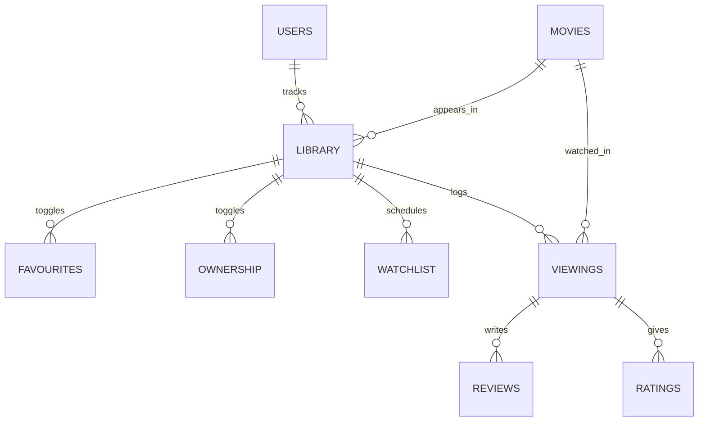

# MovieLogger

A modern web application for movie enthusiasts to track their viewing history, manage their movie collection, and maintain a watchlist.

## Overview

MovieLogger helps users:
- Track movies they've watched
- Write and maintain reviews
- Rate movies with a 5-star system
- Mark movies as owned, favorite, or watch later
- View their complete movie history

## Tech Stack

### Frontend
- React 18
- TypeScript
- Vite
- Tailwind CSS
- Headless UI

### Backend
- ASP.NET Core 8.0
- PostgreSQL
- Entity Framework Core
- xUnit & NSubstitute

## Project Structure

```
movielogger/
├── client/          # React frontend
├── server/          # ASP.NET Core backend
├── database/        # Database migrations and scripts
└── docs/           # Documentation
```

## Getting Started

1. Clone the repository:
```bash
git clone https://github.com/campbelljgilpin/movielogger.git
cd movielogger
```

2. Start the backend:
```bash
cd server
dotnet run --project src/movielogger.api
```

3. Start the frontend:
```bash
cd client
npm install
npm run dev
```

Visit `http://localhost:5173` to see the application.

## Domain Model



## Key Features

### Movie Management
- Add and edit movies
- Assign genres
- Track ownership status

### User Features
- Personal movie library
- Review and rating system
- Watch history tracking
- Watchlist management

### Review System
- Star ratings (1-5)
- Written reviews
- View history with timestamps
- Multiple reviews per movie

## Documentation

- [Frontend Documentation](client/README.md)
- [Backend Documentation](server/README.md)
- [API Documentation](docs/api.md)

## Contributing

1. Fork the repository
2. Create a feature branch
3. Commit your changes
4. Push to the branch
5. Create a Pull Request

## License

This project is licensed under the MIT License - see the [LICENSE](LICENSE) file for details.

