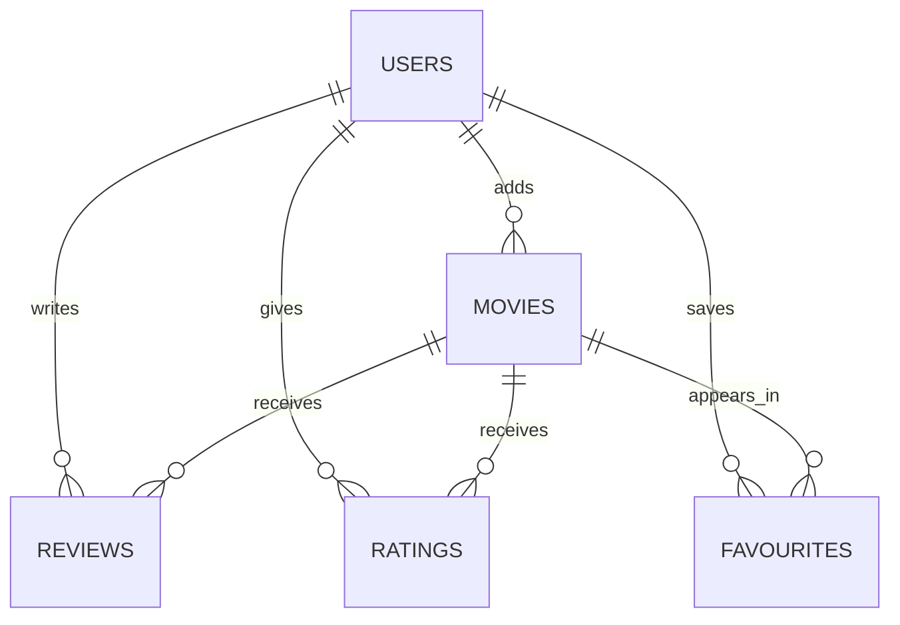
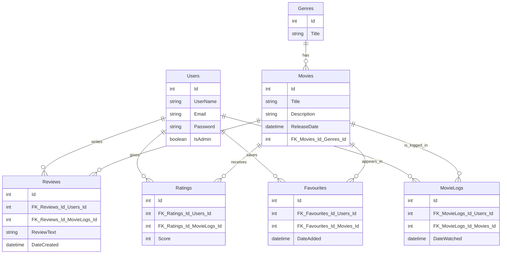

# MovieLogger

## Overview of Application

MovieLogger is a simple, user-friendly app to help movie buffs keep track of everything they've watched or want to watch. Users can log films, rate them, write reviews, add a movie to their list of favourites, and manage their personal watchlist.

## Problem Definition

Manually keeping track of movies watched, reviews written, and films to watch can quickly become messy and inconsistent. MovieLogger addresses this problem by providing an organized, digital solution for logging your movie experiences and maintaining a watchlist.

## Requirements Prioritised

### Must Have
- Ability to add movies to the database
- Ability to log movies (includes rating, review, and favourite toggle)
- Ability to edit movies (includes rating, review, and favourite toggle)
- Authentication

### Should Have
- Basic search functionality for adding movies
- Filter logged movies (by watch date, rating, or title)
- Ability to add genres and assign them to movies

### Could Have
- Tagging system (eg. "Guilty Pleasure", "Oscar Winner", etc)
- Integration with streaming platforms to check availability

### Will Not Have
- Social Features (eg. following other users)
- Mobile version
- Offline mode

## Domain Model Diagram

### Glossary

- **Admins**: A special type of user with elevated permissions. Admins can manage users and moderate content.

- **Users**: An individual who uses the MovieLogger app. Users can log movies, rate them, write reviews, and add favourites. All users must authenticate to use core features.

- **Movies**: A film entry in the database, containing title, description, release date, and genre. Users interact with movies by logging, rating, reviewing, or favouriting them.

- **Reviews**: A written review that a user attaches to a logged movie. Each review is associated with one movie and one user.

- **Ratings**: A numerical score (e.g., 1–10) that a user assigns to a movie they've logged. Each movie can have multiple ratings, but each user can rate a movie only once.

- **Favourites**: A toggle which a user can apply to a movie to mark it as a personal favourite. 

### Entity Relationship Diagram

