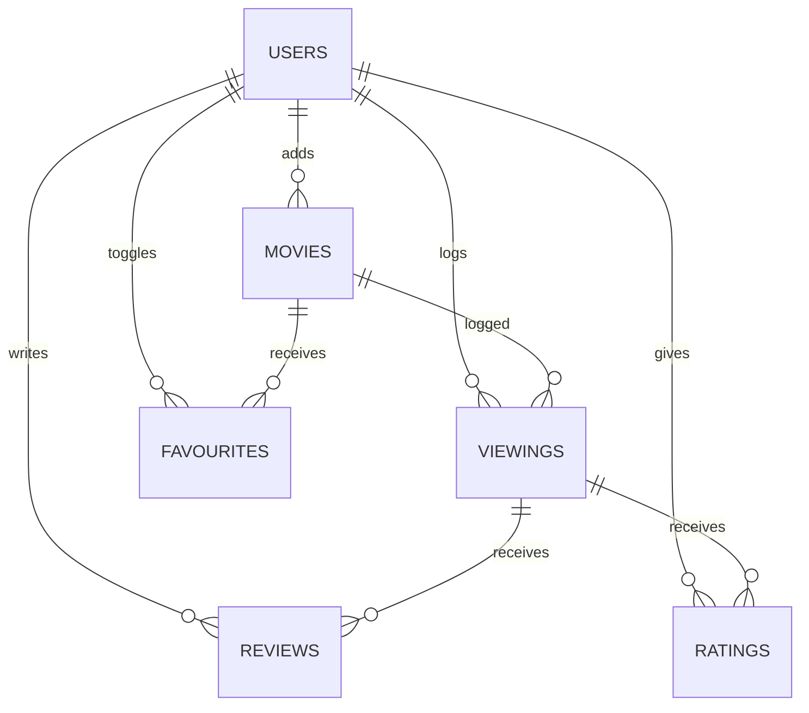

# MovieLogger

## Overview of Application

MovieLogger is a simple, user-friendly app to help movie buffs keep track of everything they've watched or want to watch. Users can log films, rate them, write reviews, add a movie to their list of favourites, and manage what they want to watch.

The application will keep a history of each time a user has watched a movie, along with any review and rating given to the film at that time.

## Problem Definition

Manually keeping track of movies watched, reviews written, and films to watch can quickly become messy and inconsistent. MovieLogger addresses this problem by providing an organized, digital solution for logging your movie experiences and maintaining a watchlist.

## Requirements Prioritised

### Must Have
- Ability to add movies to the database
- Ability to add genres to the database
- Ability to assign a genre to a movie
- Ability to log movies (includes rating, review, etc)
- Ability to edit movies (includes rating, review, etc)
- Ability to toggle movies as owned
- Ability to toggle movies as a favourite
- Authentication

### Should Have
- Basic search functionality for adding movies
- Filter logged movies (by watch date, rating, or title)

### Could Have
- Ability for users to add custom tags
- Ability for users to assign custom tags to movies
- Integration with streaming platforms to check streaming availability

### Will Not Have
- Social Features (eg. following other users)
- Mobile version
- Offline mode
- Ability for users swap movies

## Domain Model Diagram



### Glossary

- **Users**: An individual who uses the MovieLogger app. Users can log movies, rate them, write reviews, and add favourites. All users must authenticate to use core features.

- **Movies**: A film entry in the database, containing title, description, release date, and genre. Users interact with movies by logging, rating, reviewing, or favouriting them.

- **Reviews**: A written user review that is associated with a viewing. 

- **Ratings**: A numerical score (e.g., 1–10) that a user assigns to a movie they've logged. This is associated with a viewing.

- **Favourites**: A toggle which a user can apply to a movie to mark it as a personal favourite. This is independent from viewings and is tied directly to a movie.

- **Ownership**: A toggle that indicates if a user owns a specific movie. This is independent from viewings and is tied directly to a movie.

- **Viewing**: A snapshot of an invidual movie viewing. This holds the date the user viewed a specific movie, as well as their review and score associated with it.

## API Structure

## Genres

### `GET /genres`

**Description: Retrieve all genres in the system.**

Response Example:
```json
[
  { "id": 1, "title": "Action" },
  { "id": 2, "title": "Horror" },
  { "id": 3, "title": "Drama" }
]
```

---

### `GET genres/{id}`

**Description: Retrieve a specific genre by its ID.**

Response Example:
```json
{
  "id": 2,
  "title": "Horror"
}
```

---

### `PUT genres/{id}`

**Description: Update the title of an existing genre.**

Request Example:
```json
{
  "title": "Supernatural Horror"
}
```

Response Example:
```json
{
  "id": 2,
  "title": "Supernatural Horror"
}
```

---

### `DELETE genres/{id}`

**Description: Delete a genre by its ID.**

Responses:

- `204 No Content` if request was successful.

---

## Movies API

### `GET movies`

**Description:** Retrieve all movies in the system.

Response Example:
```json
[
  {
    "id": 1,
    "title": "Sinners",
    "description": "Trying to leave their troubled lives behind, twin brothers return to their hometown to start again, only to discover that an even greater evil is waiting to welcome them back.",
    "releaseDate": "2025-04-18",
    "genreId": 9,
    "isDeleted": false
  },
  {
    "id": 2,
    "title": "Mickey 17",
    "description": "A disposable employee is sent on a human expedition to colonize the ice world Niflheim. After one iteration dies, a new body is regenerated with most of his memories intact.",
    "releaseDate": "2025-03-07",
    "genreId": 1,
    "isDeleted": false
  }
]
```

---

### `GET movies/{id}`

**Description:** Retrieve a single movie by its ID.

**Response Example:**
```json
{
  "id": 1,
  "title": "Sinners",
  "description": "Trying to leave their troubled lives behind, twin brothers return to their hometown to start again, only to discover that an even greater evil is waiting to welcome them back.",
  "releaseDate": "2025-04-18",
  "genreId": 9,
  "isDeleted": false
}
```