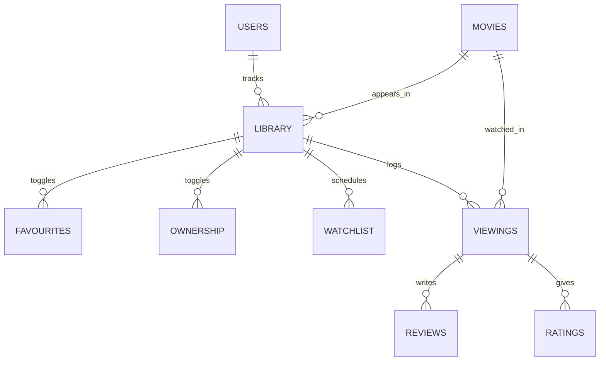
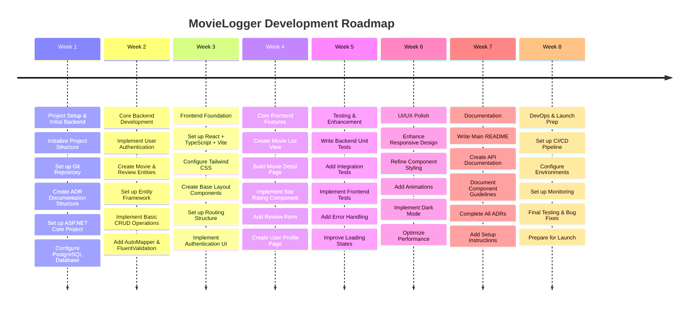

# MovieLogger

## Overview of Application

MovieLogger is a simple, user-friendly app to help movie buffs keep track of everything they've watched or want to watch. Users can log films, rate them, write reviews, add a movie to their list of favourites, and manage what they want to watch.

The application will keep a history of each time a user has watched a movie, along with any review and rating given to the film at that time.

## Problem Definition

Manually keeping track of movies watched, reviews written, and films to watch can quickly become messy and inconsistent. MovieLogger addresses this problem by providing an organized, digital solution for logging your movie experiences and maintaining a watchlist.

## Requirements Prioritised

### Must Have
- Authentication
- Ability to add movies to the database
- Ability to log movies (includes rating, review, etc)
- Ability to edit movies (includes rating, review, etc)
- Ability to toggle movies as owned
- Ability to toggle movies as a favourite

### Should Have
- Basic search functionality
- Filter logged movies (by watch date, rating, or title)

### Could Have
- Ability for users to add and assign custom tags to movies
- Integration with streaming platforms to check viewing availability

### Will Not Have
- Social Features (eg. following other users)
- Mobile version
- Offline mode
- Functionality for users to sell or trade movies

## Domain Model

### Glossary

- **Users**: An individual who uses the MovieLogger app. Users can log movies, rate them, write reviews, and add favourites. All users must authenticate to use core features.
- **Movies**: A film entry in the database, containing title, description, release date, and genre. Users interact with movies by logging, rating, reviewing, or favouriting them.
- **Library**: A movie that is tied to a user in any way is a part of their library. This includes if a movie has been favourited, reviewed, watched, or has been added to their watch later list.
- **Viewings**: A snapshot of an individual movie viewing. This holds the date the user viewed a specific movie, as well as an optional review and score associated with it.
- **Reviews**: A written user review that is associated with a viewing. There is one review per viewing, and a new review would require a new and unique viewing to be logged.
- **Ratings**: A numerical score (e.g., 1-5) that a user assigns to a movie they've logged. This is associated with a review.
- **Favourites**: A toggle which a user can apply to a movie to mark it as a personal favourite. This is independent from viewings and is tied directly to a movie.
- **Watchlist**: Movies that have a view date set.
- **Ownership**: A toggle that indicates if a user owns a specific movie. This is independent from viewings and is tied directly to a movie.

## Tech Stack

### Frontend
- React 18
- TypeScript
- Vite
- Tailwind CSS

### Backend
- ASP.NET Core 8.0
- PostgreSQL
- Entity Framework Core
- AutoMapper
- FluentValidation

## Documentation

- [Getting Started](docs/getting-started.md)
- [Frontend Documentation](client/README.md)
- [Backend Documentation](server/README.md)
- [Database Documentation](database/README.md)
- [API Documentation](docs/api.md)
- [Architecture Decisions](docs/adr/README.md)

## Roadmap & Planning

- [Trello Board](https://trello.com/b/l8hpW1Jm/movielogger)

## Contributing

1. Fork the repository
2. Create a feature branch
3. Commit your changes
4. Push to the branch
5. Create a Pull Request