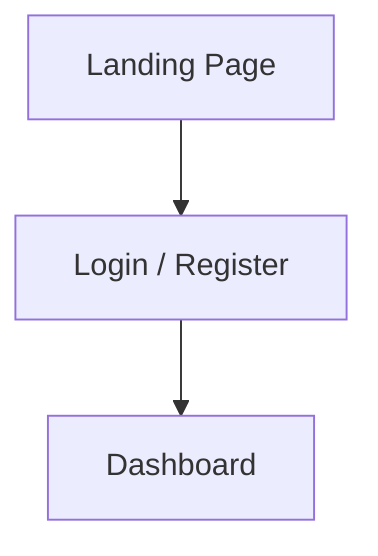

# MovieLogger

## Overview of Application

MovieLogger is a simple, user-friendly app to help movie buffs keep track of everything they've watched or want to watch. Users can log films, rate them, write reviews, add a movie to their list of favourites, and manage what they want to watch.

The application will keep a history of each time a user has watched a movie, along with any review and rating given to the film at that time.

## Problem Definition

Manually keeping track of movies watched, reviews written, and films to watch can quickly become messy and inconsistent. MovieLogger addresses this problem by providing an organized, digital solution for logging your movie experiences and maintaining a watchlist.

## Requirements Prioritised

### Must Have
- Ability to add movies to the database
- Ability to add genres to the database
- Ability to assign a genre to a movie
- Ability to log movies (includes rating, review, etc)
- Ability to edit movies (includes rating, review, etc)
- Ability to toggle movies as owned
- Ability to toggle movies as a favourite
- Authentication

### Should Have
- Basic search functionality for adding movies
- Filter logged movies (by watch date, rating, or title)

### Could Have
- Ability for users to add custom tags
- Ability for users to assign custom tags to movies
- Integration with streaming platforms to check streaming availability

### Will Not Have
- Social Features (eg. following other users)
- Mobile version
- Offline mode
- Ability for users swap movies

## Domain Model Diagram


### Glossary

- **Users**: An individual who uses the MovieLogger app. Users can log movies, rate them, write reviews, and add favourites. All users must authenticate to use core features.

- **Movies**: A film entry in the database, containing title, description, release date, and genre. Users interact with movies by logging, rating, reviewing, or favouriting them.

- **Reviews**: A written user review that is associated with a viewing. 

- **Ratings**: A numerical score (e.g., 1–10) that a user assigns to a movie they've logged. This is associated with a viewing.

- **Favourites**: A toggle which a user can apply to a movie to mark it as a personal favourite. This is independent from viewings and is tied directly to a movie.

- **Ownership**: A toggle that indicates if a user owns a specific movie. This is independent from viewings and is tied directly to a movie.

- **Viewing**: A snapshot of an invidual movie viewing. This holds the date the user viewed a specific movie, as well as their review and score associated with it.

## API Structure

### Authentication

### `POST auth/register`

**Description:** Register a new user account.

**Request Body Example:**
```json
{
  "userName": "newuser123",
  "email": "newuser@example.com",
  "password": "securepassword"
}
```

**Responses:**
- `201 Created` – User registered successfully.
- `400 Bad Request` – Missing or invalid registration details.

**Response Example:**
```json
{
  "id": 5,
  "userName": "newuser123",
  "email": "newuser@example.com",
  "isAdmin": false,
  "isDeleted": false
}
```

---

### `POST /auth/login`

**Description:** Authenticate a user and receive a token.

**Request Body Example:**
```json
{
  "email": "newuser@example.com",
  "password": "securepassword"
}
```

**Responses:**
- `200 OK` – Login successful, returns token.
- `400 Bad Request` – Missing credentials.
- `401 Unauthorized` – Invalid credentials.

**Response Example:**
```json
{
  "token": "ayJhbGciOiJIUzI1NiIsInR5cCI6IkpXVCJ9"
}
```

### Users

### `GET users`

**Description:** Get all users.

**Responses:**
- `200 OK`
- `404 Not Found`

**Response Example:**
```json
[
  {
    "id": 1,
    "userName": "moviebuff88",
    "email": "buff@example.com",
    "isAdmin": false,
    "isDeleted": false
  },
  {
    "id": 2,
    "userName": "admin_user",
    "email": "admin@example.com",
    "isAdmin": true,
    "isDeleted": false
  }
]
```

### `GET users/{id}`

**Description:** Retrieve a specific user by their id.

**Responses:**
- `200 OK`
- `404 Not Found`

**Response Example:**
```json
{
  "id": 1,
  "userName": "moviebuff88",
  "email": "buff@example.com",
  "isAdmin": false,
  "isDeleted": false
}
```

### `POST users`

**Description:** Add a new user to the system.

**Request Example:**
```json
{
  "userName": "cinemafan123",
  "email": "cinema@example.com",
  "password": "supersecurepassword",
  "isAdmin": false,
}
```

**Responses:**
- `201 Created`
- `400 Bad Request`

**Response Example:**
```json
{
  "id": 3,
  "userName": "cinemafan123",
  "email": "cinema@example.com",
  "isAdmin": false,
  "isDeleted": false
}
```

### `PUT users/{id}`

**Description:** Update a user.

**Request Example:**
```json
{
  "userName": "cinemafan_updated",
  "email": "newemail@example.com",
  "isAdmin": false,
  "isDeleted": false
}
```

**Response Example:**
```json
{
  "id": 3,
  "userName": "cinemafan_updated",
  "email": "newemail@example.com",
  "isAdmin": false,
  "isDeleted": false
}
```

### `DELETE users/{id}`

**Description:** Delete a user account.

**Responses:**
- `204 No Content`
- `404 Not Found`

---

### Genres

### `GET /genres`

**Description:** Retrieve all genres in the system.

**Responses:**
- `200 OK`
- `404 Not Found`

**Response Example:**
```json
[
  { "id": 1, "title": "Action" },
  { "id": 2, "title": "Horror" },
  { "id": 3, "title": "Drama" }
]
```

---

### `GET genres/{id}`

**Description:** Retrieve a specific genre by its ID.

**Responses:**
- `200 OK`
- `404 Not Found`

**Response Example:**
```json
{
  "id": 2,
  "title": "Horror"
}
```

---

### `PUT genres/{id}`

**Description:** Update the title of an existing genre.

**Request Example:**
```json
{
  "id": 2,
  "title": "Supernatural Horror"
}
```

**Responses:**
- `200 OK`
- `400 Bad Request`
- `404 Not Found`

**Response Example:**
```json
{
  "id": 2,
  "title": "Supernatural Horror"
}
```

---

### Movies

### `GET movies`

**Description:** Retrieve all movies in the system.

**Response Example:**
```json
[
  {
    "id": 1,
    "title": "Sinners",
    "description": "Trying to leave their troubled lives behind, twin brothers return to their hometown to start again, only to discover that an even greater evil is waiting to welcome them back.",
    "releaseDate": "2025-04-18",
    "genreId": 9,
    "isDeleted": false
  },
  {
    "id": 4,
    "title": "Mickey 17",
    "description": "A disposable employee is sent on a human expedition to colonize the ice world Niflheim. After one iteration dies, a new body is regenerated with most of his memories intact.",
    "releaseDate": "2025-03-07",
    "genreId": 1,
    "isDeleted": false
  }
]
```

---

### `GET movies/{id}`

**Description:** Retrieve a single movie by its ID.

**Responses:**
- `200 OK`
- `404 Not Found`

**Response Example:**
```json
{
  "id": 1,
  "title": "Sinners",
  "description": "Trying to leave their troubled lives behind, twin brothers return to their hometown to start again, only to discover that an even greater evil is waiting to welcome them back.",
  "releaseDate": "2025-04-18",
  "genreId": 9,
  "isDeleted": false
}
```

---

### `POST movies`

**Description:** Add a new movie to the system.

**Request Example:**
```json
{
  "title": "Companion",
  "description": "A weekend getaway with friends at a remote cabin turns into chaos after it's revealed that one of the guests is not what they seem.",
  "releaseDate": "2025-01-31",
  "genreId": 9
}
```

**Responses:**
- `201 Created`
- `400 Bad Request`

**Response Example:**
```json
{
  "id": 2,
  "title": "Companion",
  "description": "A weekend getaway with friends at a remote cabin turns into chaos after it's revealed that one of the guests is not what they seem.",
  "releaseDate": "2025-01-31",
  "genreId": 9,
  "isDeleted": false
}
```

---

### `PUT movies/{id}`

**Description:** Update the details of an existing movie.

**Request Body Example:**
```json
{
  "title": "Pulp Fiction",
  "description": "In the realm of underworld, a series of incidents intertwines the lives of two Los Angeles mobsters, a gangster's wife, a boxer and two small-time criminals.",
  "releaseDate": "1992-10-21",
  "genreId": 9
}
```

**Responses:**
- `200 OK`
- `400 Bad Request`
- `404 Not Found`

**Response Example:**
```json
{
  "id": 3,
  "title": "Pulp Fiction",
  "description": "In the realm of underworld, a series of incidents intertwines the lives of two Los Angeles mobsters, a gangster's wife, a boxer and two small-time criminals.",
  "releaseDate": "1992-10-21",
  "genreId": 9,
  "isDeleted": false
}
```

---

### `DELETE movies/{id}`

**Description:** Soft-delete a movie by marking it as deleted (`isDeleted = true`).

**Responses:**
- `204 No Content`
- `404 Not Found`

---

### Viewings

### `GET users/{userId}/movies`

**Description:** Retrieve all movies in a specific user's library.

**Responses:**
- `200 OK`
- `404 Not Found`

**Response Example:**
```json
[
  {
    "id": 12,
    "userId": 4,
    "movieId": 1,
    "favourite": true,
    "ownsMovie": false,
    "upcomingViewDate": null,
    "movie": {
      "id": 2,
      "title": "Companion",
      "description": "A weekend getaway with friends at a remote cabin turns into chaos after it's revealed that one of the guests is not what they seem.",
      "releaseDate": "2025-01-31",
      "genreId": 9
    }
  },
  {
    "id": 13,
    "userId": 4,
    "movieId": 3,
    "favourite": false,
    "ownsMovie": true,
    "upcomingViewDate": "2025-05-01",
    "movie": {
      "id": 3,
      "title": "Pulp Fiction",
      "description": "In the realm of underworld, a series of incidents intertwines the lives of two Los Angeles mobsters, a gangster's wife, a boxer and two small-time criminals.",
      "releaseDate": "1992-10-21",
      "genreId": 9
    }
  }
]
```

---

### `POST users/{userId}/movies`

**Description:** Add a movie to the user's collection.

**Request Body Example:**
```json
{
  "movieId": 2,
  "favourite": false,
  "ownsMovie": true,
  "upcomingViewDate": "2025-06-15"
}
```

**Responses:**
- `200 OK`
- `400 Bad Request`

**Response Example:**
```json
{
  "id": 14,
  "userId": 4,
  "movieId": 2,
  "favourite": false,
  "ownsMovie": true,
  "upcomingViewDate": "2025-06-15"
}
```

---

### `PUT user-movies/{id}`

**Description:** Update flags or viewing info for a user-movie entry.

**Request Body Example:**
```json
{
  "favourite": true,
  "ownsMovie": false,
  "upcomingViewDate": null
}
```

**Responses:**
- `200 OK`
- `400 Bad Request`
- `404 Not Found`

**Response Example:**
```json
{
  "id": 14,
  "userId": 4,
  "movieId": 5,
  "favourite": true,
  "ownsMovie": false,
  "upcomingViewDate": null
}
```

---

### `DELETE user-movies/{id}`

**Description:** Remove a movie from user's library.

**Responses:**
```
204 No Content
```

---

### Reviews

### `GET users/{userId}/reviews`
### `PUT reviews/{id}`

## User Personas

### Casual User

- Wants to simply keep track of what they've watched, and want to watch.
- Will occasionally write reviews.

### Collector

- Wants a solution to easily keep track and search of movies they've collected.
- Will reguarly add new movies to their owned list.

### Data-Oriented User

- Wants an easy solution to view statistics, such as how many movies they've watched or own.
- Wants to filter and sort through their viewing history.
- May organise their films into collections uses tags.

## User Journeys


