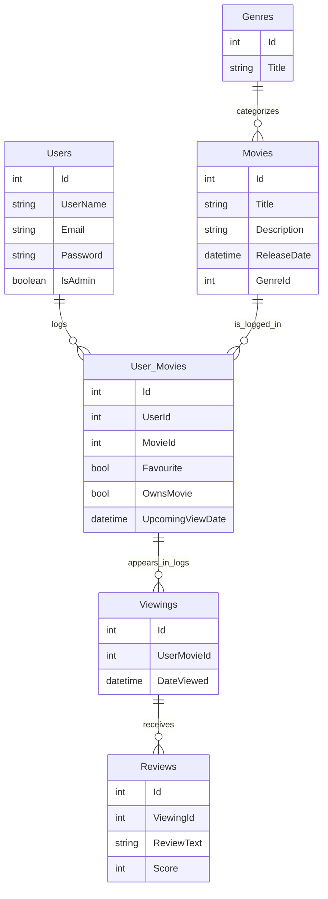

# MovieLogger

### Entity Relationship Diagram

```mermaid
erDiagram
    Users ||--o{ User_Movies : logs

    Movies ||--o{ User_Movies : is_logged_in

    Genres ||--o{ Movies : categorizes

    User_Movies ||--o{ Viewings : appears_in_logs

    Viewings ||--o{ Reviews : receives

    Users {
        int Id
        string UserName
        string Email
        string Password
        boolean IsAdmin
    }

    Movies {
        int Id
        string Title
        string Description
        datetime ReleaseDate
        int GenreId
    }

   Genres {
        int Id
        string Title
    }

    Reviews {
        int Id
        int ViewingId
        string ReviewText
        int Score
    }

    Viewings {
        int Id
        int UserMovieId
        datetime DateViewed
    }

    User_Movies { 
        int Id
        int UserId
        int MovieId
        bool Favourite
        bool OwnsMovie
        datetime UpcomingViewDate
    }
```